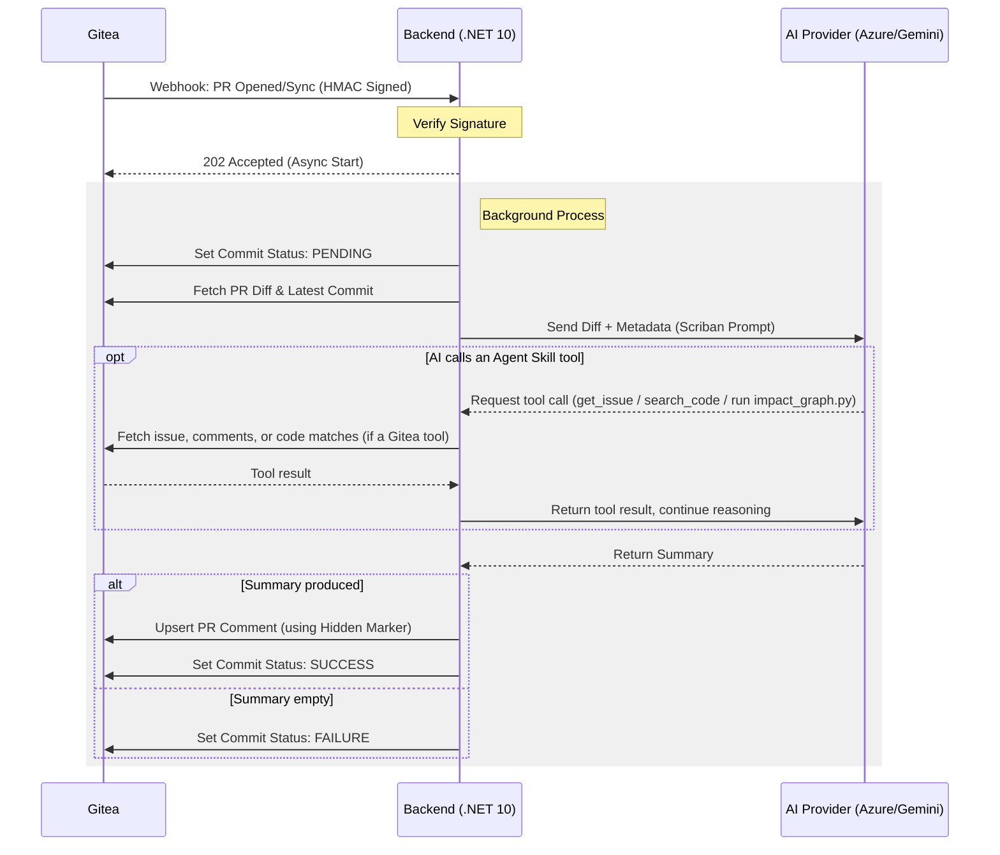

# Gitea AI PR Summarizer

An automated PR summarization service that listens to Gitea Webhook events, analyzes code changes (diffs) using AI Models (Azure AI, OpenAI, Gemini, etc.), and posts summary comments directly to your Pull Requests.

---

## 🚀 Overview

The system receives a Webhook from Gitea when a PR is opened or updated, fetches the diff content, processes it through an AI engine with a pre-defined prompt template, and leaves an insightful summary for reviewers.

### 🔄 System Flow



### Key Features
- **Multi-LLM Support:** Azure AI Foundry, OpenAI, Gemini, Ollama, and Anthropic.
- **Agent Skills:** the AI can call back into Gitea (`get_issue`, `get_issue_comments`, `search_code`) and run local analysis scripts (`impact_graph.py` for symbol/route/Docker impact) during review — extensible via `GiteaAiSummarizerNET/src/GiteaAiSummarizer/Templates/Skills/`.
- **Diff Management:** 3-tier strategy (Full / Chunked / File-level) to handle large changes within token limits.
- **Security:** HMAC-SHA256 signature verification for all incoming webhooks.
- **Customizable:** Change the summary tone and structure via `GiteaAiSummarizerNET/src/GiteaAiSummarizer/Templates/default-prompt.txt`.

---

## 🛠 Tech Stacks

### 🔹 .NET Implementation (Current)
The production-ready version is built using **ASP.NET Core 10 Minimal API**.

- **Framework:** .NET 10.0
- **AI Library:** `Microsoft.Extensions.AI` (Unified AI abstraction)
- **Status:** Maintained & Active

#### Quick Start (.NET)
1. **Clone & Configure:**
   ```bash
   git clone https://github.com/your-repo/GiteaAiSummarizer.git
   cp .env.example .env
   ```
2. **Setup Environment:** Update your `.env` with Gitea and AI provider credentials.
3. **Launch with Docker:**
   ```bash
   docker-compose up -d --build
   ```

### 🔸 Go Implementation (Future)
A lightweight alternative implementation planned for high-concurrency and low-resource environments.

- **Stack:** Go 1.22+ / chi router
- **Status:** 🏗️ Under Design (Future Implementation)
- **Goals:** Smaller binary size (< 20MB), faster startup, and lower memory footprint.

---

## 📂 Project Structure

```text
.
├── GiteaAiSummarizerNET/
│   ├── src/
│   │   └── GiteaAiSummarizer/  # .NET Core app project
│   ├── tests/
│   │   └── GiteaAiSummarizer.Tests/
│   └── Dockerfile
├── docker-compose.yml          # Container orchestration
└── .env.example                # Environment template
```

---

## ⚙️ Configuration (.env)

| Variable | Description | Default |
|----------|-------------|---------|
| `Gitea__Url` | Your Gitea Instance URL | - |
| `Gitea__AccessToken` | Gitea Personal Access Token | - |
| `AI__ENGINE_TYPE` | Azure / OpenAI / Gemini / Ollama | Azure |
| `AI__API_KEY` | API Key for selected provider | - |
| `MaxDiffSizeKb` | Max diff size before chunking | 50 |

---

## ⚖️ License
MIT License - Feel free to use and contribute!


### Environment Variables

| Variable | Required | Default | Description |
|---|---|---|---|
| `Gitea__Url` | Yes | — | URL of your Gitea instance |
| `Gitea__AccessToken` | Yes | — | Personal Access Token of the bot user |
| `Gitea__WebhookSecret` | Yes | — | Secret for verifying webhook HMAC-SHA256 signatures |
| `Gitea__StatusContext` | No | `ai/pr-summary` | Commit status context used as merge gate in protected branches |
| `AI__ENGINE_TYPE` | No | `Azure` | Selected provider: `Azure`, `OpenAI`, `Gemini`, `Ollama`, `Anthropic` |
| `AI__ENDPOINT` | Yes (Azure/Ollama) | — | API Endpoint URL |
| `AI__MODEL_NAME` | Yes | — | Model name (e.g., `gpt-4o`, `gemini-1.5-flash`) |
| `AI__API_KEY` | Yes | — | API Key for the selected provider |
| `AdminToken` | No | — | Bearer token for the manual trigger endpoint |
| `MaxDiffSizeKb` | No | `50` | Maximum diff size before switching to chunking strategy |
| `Serilog__MinimumLevel__Default` | No | `Information` | Logging level |

### Diff Processing Strategy

| Diff Size | Strategy | Details |
|---|---|---|
| < 50 KB | Full Diff | Sends the entire diff in a single request |
| 50 – 200 KB | Chunked | Splits by file and summarizes each chunk, then combines them |
| > 200 KB | File-Level Summary | Sends only the file list and basic statistics |

---

## API Endpoints

### Webhook Receiver

```
POST /api/v1/webhook/gitea
X-Gitea-Signature: <HMAC-SHA256>
```

Supports PR actions: `opened`, `synchronized`, `reopened`, `edited`.

### Health Check

```
GET /health
```

```json
{
  "status": "healthy",
  "gitea": "connected",
  "ai": "Azure: available",
  "uptime": "2h15m"
}
```

### Manual Trigger

```
POST /api/v1/summarize/{owner}/{repo}/{pr_number}
Authorization: Bearer <AdminToken>
```

Used when a webhook is missed or a re-summary is required.

---

## Gitea Setup

1. Create a Bot User on Gitea (e.g., `ai-reviewer`) and generate a Personal Access Token with permissions to read repositories, write issue comments, and write commit statuses.
2. Add the bot user as a collaborator to your repository.
3. Navigate to **Repository → Settings → Webhooks → Add Webhook → Gitea**.
4. Configure the following:
   - **Target URL:** `https://your-backend.example.com/api/v1/webhook/gitea`
   - **HTTP Method:** `POST`
   - **Content Type:** `application/json`
   - **Secret:** Must match your `Gitea__WebhookSecret`
   - **Trigger:** Select `Pull Request`
5. Configure protected branch rules (for example `main`) and require status check context `ai/pr-summary` (or your configured `Gitea__StatusContext`) before merge.

---

## PR Comment Output Example

```markdown
🤖 **AI Summary** (powered by Azure AI)

## 🔍 Summary
This PR adds JWT-based authentication with login/logout endpoints...

## 📁 Changes Breakdown
| File | Change | Detail |
|------|--------|--------|
| `auth/jwt.go` | Added | JWT token generation and validation |
| `middleware/auth.go` | Added | Authentication middleware |

## ⚠️ Impact Analysis
- **Breaking:** New `Authorization` header required for protected endpoints
- **Security:** Token expiry set to 24h — consider shorter duration

## 💡 Review Hints
- Check token refresh logic in `auth/jwt.go:45-60`

---
Generated by Gitea AI Summarizer • took 3.2s
```

---

## Custom Prompt Template

Modify the file `GiteaAiSummarizerNET/src/GiteaAiSummarizer/Templates/default-prompt.txt` to customize the prompt logic:

```text
You are a senior code reviewer...

PR Title: {{ pr_title }}
PR Description: {{ pr_body }}
Target Branch: {{ base_branch }}
Source Branch: {{ head_branch }}

Diff:
{{ diff_content }}
```

Available variables: `pr_title`, `pr_body`, `base_branch`, `head_branch`, `diff_content`, `extra_instruction`.

---

## Development

### Run locally

```bash
cd GiteaAiSummarizerNET

# ใส่ config ใน appsettings.Development.json หรือ set env vars
dotnet run --project src/GiteaAiSummarizer/GiteaAiSummarizer.csproj
```

### Build

```bash
cd GiteaAiSummarizerNET
dotnet build GiteaAiSummarizer.sln
dotnet publish src/GiteaAiSummarizer/GiteaAiSummarizer.csproj -c Release
```

### Docker

```bash
# From Project Root
cd GiteaAiSummarizerNET
docker build -t pingkunga/gitea-ai-summarizer:0.2.2 .
docker tag pingkunga/gitea-ai-summarizer:0.2.2 pingkunga/gitea_aihook:0.2.2
docker push pingkunga/gitea_aihook:0.2.2

docker run -p 8080:8080 --env-file .env gitea-ai-summarizer
```

---

## Stack

- **Runtime:** .NET 10 / ASP.NET Core 10 Minimal API
- **AI Providers:** Anthropic Claude, Google Gemini
- **Template Engine:** Scriban
- **Logging:** Serilog
- **Container:** Docker (multi-stage, `aspnet:10.0`)

dotnet run --project GiteaAiSummarizerNET/src/GiteaAiSummarizer/GiteaAiSummarizer.csproj --urls "http://localhost:5000"
